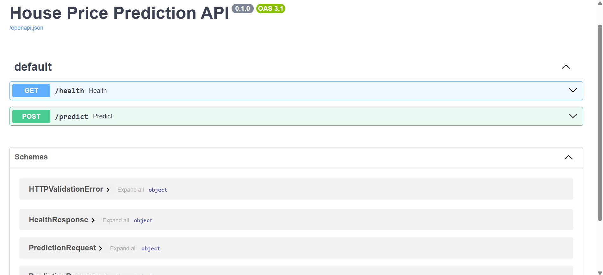
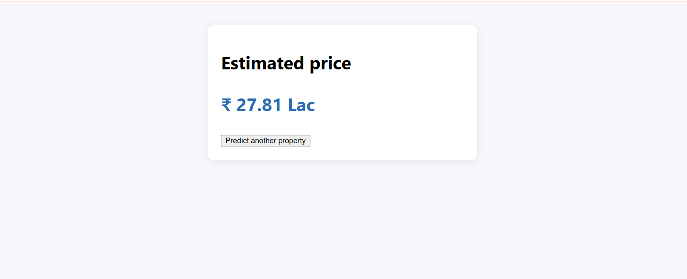
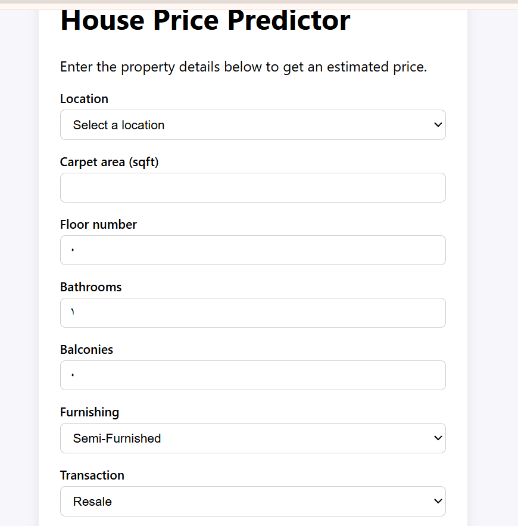

# House Price Prediction — End-to-End ML Web App

Predicts Indian property prices from listing details (location, carpet area, floor,
bathrooms, furnishing, etc.) using a scikit-learn regression pipeline served through a
FastAPI backend and a React frontend.

## Overview

```
User fills form (React) → POST /predict (FastAPI) → scikit-learn Pipeline (.pkl) → predicted price
```

The model is trained in a Jupyter notebook on the
[House Price dataset by Juhi Bhojani](https://www.kaggle.com/datasets/juhibhojani/house-price)
(Kaggle, ~187,000 Indian property listings) and exported as a single scikit-learn
`Pipeline` that bundles all preprocessing (imputing, scaling, one-hot encoding), so the
backend only has to build a one-row DataFrame and call `.predict()`.

## Tech stack

| Layer      | Tech |
|------------|------|
| Modeling   | Python, pandas, scikit-learn, Jupyter |
| Backend    | FastAPI, Pydantic, joblib |
| Frontend   | React, TypeScript, Vite, react-router-dom |

## Project structure

```
house-price-project/
├── notebooks/
│   ├── house_price_model.ipynb   # cleaning, EDA, training, export
│   └── data/                     # put house_prices.csv here (gitignored)
├── backend/
│   ├── app/
│   │   ├── main.py               # FastAPI app, CORS, model loaded at startup
│   │   ├── api/routes/prediction.py   # GET /health, POST /predict
│   │   ├── core/config.py        # settings from .env
│   │   ├── schemas/prediction.py # request/response models
│   │   ├── services/
│   │   │   ├── preprocessing.py  # request -> one-row DataFrame
│   │   │   └── inference.py      # loads .pkl, runs predict
│   │   └── utils/logging_config.py
│   ├── models/                   # house_price.pkl + locations.json go here
│   ├── tests/test_prediction.py
│   ├── requirements.txt
│   ├── .env.example
│   └── Dockerfile
├── frontend/
│   ├── src/
│   │   ├── api/predictionClient.ts
│   │   ├── components/PredictionForm.tsx
│   │   ├── pages/HomePage.tsx | ResultPage.tsx | NotFoundPage.tsx
│   │   ├── types/prediction.ts
│   │   └── App.tsx
│   ├── public/locations.json     # dropdown options, exported by the notebook
│   └── .env.example
└── README.md
```

## 1. Get the dataset

Dataset: [House Price by Juhi Bhojani](https://www.kaggle.com/datasets/juhibhojani/house-price) (Kaggle).

**Option A — manual:** download from the link above, unzip, and place the CSV at
`notebooks/data/house_prices.csv`.

**Option B — Kaggle CLI:**
```bash
pip install kaggle
# Get your API token: Kaggle -> Settings -> API -> "Create New Token"
# Place kaggle.json in ~/.kaggle/ (macOS/Linux) or C:\Users\<you>\.kaggle\ (Windows)
kaggle datasets download -d juhibhojani/house-price -p notebooks/data --unzip
```

## 2. Train the model (Jupyter notebook)

```bash
cd notebooks
python -m venv .venv
source .venv/bin/activate        # Windows: .venv\Scripts\activate
pip install jupyter pandas numpy scikit-learn matplotlib seaborn joblib
jupyter notebook house_price_model.ipynb
```

Run all cells top to bottom (Kernel → Restart & Run All). This produces two files in
`notebooks/`:
- `house_price.pkl` — the trained pipeline
- `locations.json` — the list of known locations for the frontend dropdown

Copy them into place:
```bash
cp notebooks/house_price.pkl backend/models/house_price.pkl
cp notebooks/locations.json backend/models/locations.json
cp notebooks/locations.json frontend/public/locations.json
```

**Note the scikit-learn version** printed at the end of the notebook and pin it in
`backend/requirements.txt` — a pickle only loads reliably with the same version it was
saved with.

## 3. Run the backend (FastAPI)

```bash
cd backend
python -m venv .venv
source .venv/bin/activate        # Windows: .venv\Scripts\activate
pip install -r requirements.txt
cp .env.example .env
uvicorn app.main:app --reload
```

- API docs: http://localhost:8000/docs
- Health check: `GET http://localhost:8000/health`

Run tests:
```bash
pytest
```

### Environment variables (`backend/.env`)

| Variable         | Default                        | Description                       |
|------------------|---------------------------------|------------------------------------|
| `MODEL_PATH`     | `models/house_price.pkl`        | Path to the trained pipeline       |
| `LOCATIONS_PATH` | `models/locations.json`         | Path to the known-locations list   |
| `CORS_ORIGINS`   | `http://localhost:5173`         | Allowed frontend origin(s)         |

## 4. Run the frontend (React + Vite)

```bash
cd frontend
npm install
cp .env.example .env
npm run dev
```

Open http://localhost:5173, fill in the form, and submit to see a live prediction
(make sure the backend is running on port 8000 first).

### Environment variables (`frontend/.env`)

| Variable              | Default                    | Description            |
|-----------------------|-----------------------------|--------------------------|
| `VITE_API_BASE_URL`   | `http://localhost:8000`     | Base URL of the FastAPI backend |

## API reference

### `GET /health`
```json
{ "status": "ok" }
```

### `POST /predict`

```bash
curl -X POST http://localhost:8000/predict \
  -H "Content-Type: application/json" \
  -d '{
    "location": "Whitefield",
    "carpet_area_sqft": 1200,
    "floor_num": 3,
    "bathroom": 2,
    "balcony": 1,
    "furnishing": "Semi-Furnished",
    "transaction": "Resale",
    "ownership": "Freehold",
    "facing": "East"
  }'
```

Response:
```json
{ "predicted_price": 8500000.0 }
```

## Model metrics

_Fill in after running the notebook (section 2.5 prints these for you):_

| Model                        | MAE | RMSE | R² |
|-------------------------------|-----|------|----|
| Linear Regression (baseline) |     |      |    |
| Random Forest                |     |      |    |

## Limitations & next steps

- Trained only on the locations present in the Kaggle dataset; unseen locations map to `"other"`.
- Random Forest pickle can be large — check size before committing to GitHub (< 50 MB rule of thumb).
- Possible improvements: hyperparameter tuning (GridSearchCV), Gradient Boosting / XGBoost, zipcode-style geocoding for location.
# Screenshots

### Prediction 


### Prediction result


### Prediction form


